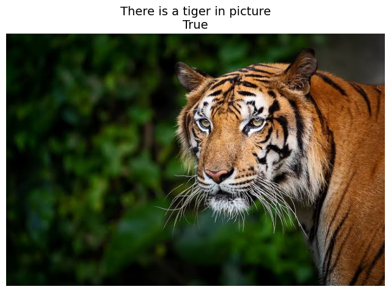

# Named Entity Recognition + Image Classification

## Task Description

In this project, you will build a machine learning pipeline that consists of two models responsible for completely different tasks. The main objective is to understand what the user is asking (Natural Language Processing) and verify if it is correct using Computer Vision.

### Requirements

1. **Dataset Collection:** Find or collect an animal classification/detection dataset containing at least 10 classes of animals.

2. **NER Model:** Train a Named Entity Recognition (NER) model to extract animal names from text using a transformer-based model (excluding large language models, LLMs).

3. **Image Classification Model:** Train an animal classification model using the prepared dataset.

4. **Pipeline Integration:** Develop a pipeline that accepts a text message and an image as inputs.

### Expected Workflow

1. The user provides a text input, e.g., *"There is a cow in the picture."* and an image containing any animal.

2. The pipeline should analyze whether the text description matches the image content and return a boolean value (`True` or `False`).

3. The text input should be flexible to handle different phrasings and expressions from the user.

## Dataset

### For image classification

The dataset used in this project is the **"Animals with Attributes 2" (AwA2)** dataset, which is publicly available at [https://cvml.ista.ac.at/AwA2/](https://cvml.ista.ac.at/AwA2/).

The AwA2 dataset contains images of 50 animal classes along with attribute annotations, making it a popular choice for fine-grained image classification and attribute prediction tasks.

### For NER model

The dataset used for the Named Entity Recognition (NER) task in this project is **"MultiNERD"**, which is publicly available on Hugging Face at [https://huggingface.co/datasets/Babelscape/multinerd](https://huggingface.co/datasets/Babelscape/multinerd).

**MultiNERD** is a multilingual dataset designed for fine-grained and coarse-grained NER tasks, covering a wide range of entity types across different languages.

But the key point here is that there are animal tags in the dataset, and not all languages are needed, only English.

## Model Selection and Training Strategy

### Image Classification

For the image classification task, I ultimately selected `ResNet50` as the model architecture. During experimentation, I also tested other architectures including `ResNet34`, `Inception`, `EfficientNet B3/B4`, and `ConvNext`. While all models showed decent performance, `ResNet50` stood out by providing slightly better accuracy and stability during training.

Initially, I attempted training with unfrozen weights, but this approach led to the worst performance as the model struggled to converge. Switching to frozen weights and adding a few fully connected layers at the end improved the results but introduced a plateau where the loss function could not drop further.

To overcome this, I unfroze only the last layer of `ResNet50`, allowing fine-tuning on higher-level features while retaining the robustness of pre-trained weights. This approach yielded an Accuracy of 95%, which I considered a satisfactory result for this task.

### Named Entity Recognition (NER)

For the NER model, I chose bert-base-uncased due to its strong generalization capabilities and efficiency for token classification tasks. The `BERT` architecture is well-suited for handling contextual embeddings, which allows the model to better understand the relationship between words in a sentence.

Instead of training the model solely on animal tokens, I expanded the training dataset to include 15 different token classes. This approach enhanced the model's flexibility and improved its performance on animal token recognition by providing broader context and reducing overfitting. As a result, the NER model demonstrated greater accuracy and adaptability to various text inputs.

## Result
This is result from `workflow.ipynb`, You can see it at the end of the notebook.

</img>

## Navigate


- **`classifier/`** – Contains all classifier files:
  - **`train.py`** – Parametrized training script for the image classification model.
  - **`inference.py`** – Parametrized inference script for the image classification model.
  - **`model.py`** – ResNet-50 model implementation.
- **`NER/`** – Contains all NER files:
  - **`train.py`** – Parametrized training script for the NER model.
  - **`inference.py`** – Parametrized inference script for the NER model.
- **`results.py`** – Python script for the entire pipeline that takes 2 inputs (text and image) and provides 1 boolean value as output.
- **`readme.md`** – Documentation for the project, detailing setup steps and usage instructions.
- **`requirements.txt`** – List of all libraries and dependencies needed to run this solution.

- **`workflow.ipynb`** – Jupyter Notebook duplicate file all solution with explanations for easier understanding. It include demonstrating data loading, training, evaluation, and edge-case handling.

## Usage


To get results use this one:

```sh
python result.py --image_path "<image_path>" --text "<text>"
```

To use one of the models separately, use one of these commands:

```sh
python classifier/inference.py --image_path "<image_path>"
```
```sh
python NER/inference.py --text "<text>"
```

##  Conclusion

This project provided an excellent opportunity to practice building a complex ML pipeline that integrates Natural Language Processing and Computer Vision. Working on this task was both challenging and rewarding, allowing me to enhance my skills in model training, dataset preparation, and pipeline integration.

However, there were a few limitations worth mentioning:

1. **Limited Number of Classes:** The classification dataset contained only 50 specific animal breeds, lacking broader generalizations such as 'cat' or 'dog'. This specificity could lead to reduced accuracy in cases where a more general classification is needed.

2. **NER Model disadvantage:** While the NER model performed reasonably well, it struggled with sentences containing many tokens. It occasionally misclassified entities or ignored some relevant tokens, highlighting potential areas for improvement in text preprocessing and model fine-tuning.

Overall, this project was a valuable learning experience, and I look forward to applying these insights to future projects.


